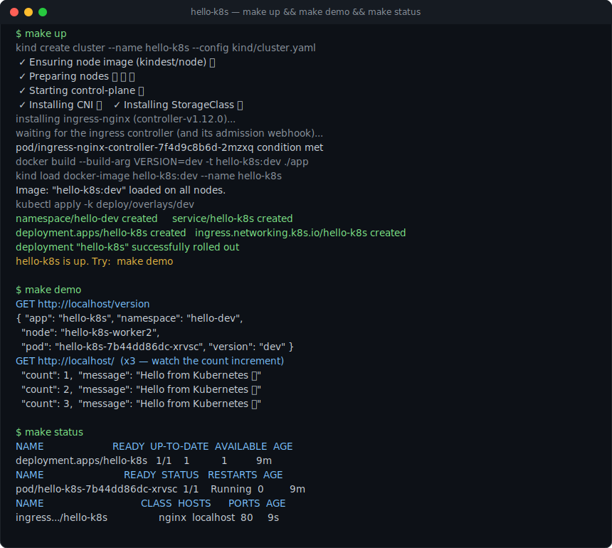

# hello-k8s

> A small, production-shaped Kubernetes demo you can run end-to-end with **one command** on a local [kind](https://kind.sigs.k8s.io/) cluster.

[](https://github.com/memumerafzal/k8s/actions/workflows/ci.yaml)


This repo is intentionally compact but demonstrates the practices I reach for on real clusters: a hardened container, meaningful health/readiness probes, graceful shutdown, environment management with **Kustomize overlays**, an **Ingress**, an **HPA + PodDisruptionBudget** for prod, and a **CI pipeline** that lints the manifests and runs an end-to-end test on kind.

```
make up      # kind cluster + ingress-nginx + build + deploy   (≈2–3 min)
make demo    # curl the app through the Ingress
make down    # tear it all down
```

## Demo

<p align="center">
  
</p>

> `make up` stands up a 3-node kind cluster, installs ingress-nginx, builds + loads the image and deploys the dev overlay. `make demo` then hits the service through the Ingress on `localhost` — note the real pod name/node from the downward API and the request counter incrementing.

---

## Architecture

```
                 curl http://localhost/
                          │
                          ▼
        ┌───────────────────────────────────┐
        │   kind cluster (1 cp + 2 workers)  │
        │                                    │
        │   ingress-nginx  ──►  Service      │
        │                        (ClusterIP) │
        │                          │         │
        │                          ▼         │
        │            Deployment: hello-k8s   │
        │            ┌──────┐ ┌──────┐        │
        │            │ pod  │ │ pod  │  ...   │  ← replicas per overlay
        │            └──────┘ └──────┘        │     (dev: 1, prod: 3 + HPA)
        └───────────────────────────────────┘
```

The app is a ~130-line, **dependency-free Go** web service ([`app/main.go`](app/main.go)). It exposes:

| Endpoint    | Purpose                                                        |
| ----------- | ------------------------------------------------------------- |
| `GET /`     | Greeting + pod identity (name/namespace/node) + request count |
| `GET /healthz` | Liveness — process is alive                                |
| `GET /readyz`  | Readiness — `503` during warm-up and during shutdown drain |
| `GET /version` | Build/version + pod metadata (from the downward API)       |
| `GET /metrics` | Minimal Prometheus counter                                 |

---

## Repository layout

```
app/                         tiny Go service + multi-stage, distroless Dockerfile
deploy/
  base/                      Deployment, Service, Ingress + shared labels
  overlays/
    dev/                     namespace hello-dev · 1 replica · tag :dev
    prod/                    namespace hello-prod · 3 replicas · HPA · PDB · topology spread · tag :v1.0.0
kind/cluster.yaml            3-node kind cluster wired for ingress on localhost:80
.github/workflows/ci.yaml    build+vet · manifest validation · e2e-on-kind
Makefile                     the whole workflow (run `make help`)
```

---

## Prerequisites

- **Docker** and **kubectl** (Kustomize ships inside `kubectl`)
- **kind** and **kubeconform** — install with `make tools` (Homebrew)

## Usage

```bash
make tools     # one-time: install kind + kubeconform
make up        # create cluster, install ingress-nginx, build image, deploy dev
make demo      # hit the service through the Ingress
make status    # deployments / pods / svc / ingress / hpa / pdb
make down      # delete the cluster
```

Deploy the **prod** overlay instead (3 replicas, HPA, PDB, topology spread):

```bash
make metrics             # HPA needs metrics-server on kind
make deploy OVERLAY=prod
kubectl -n hello-prod get hpa,pdb
```

Preview exactly what gets applied, without a cluster:

```bash
make render OVERLAY=prod   # kubectl kustomize deploy/overlays/prod
make lint                  # render both overlays + validate against the k8s schema
```

---

## Design decisions

- **Kustomize over Helm** — no templating indirection; `base + overlays` reads like plain Kubernetes and diffs cleanly. Overlays change only what actually differs between environments (namespace, replicas, image tag, HPA/PDB).
- **Distroless + non-root + read-only rootfs** — the runtime image has no shell or package manager, runs as UID `65532`, drops all capabilities, and can't write its own filesystem. `securityContext` is set at both pod and container level.
- **Probes that mean something** — `/readyz` returns `503` during a simulated warm-up and again while draining after `SIGTERM`, so rollouts and shutdowns don't drop traffic. A `startupProbe` gates the others.
- **Graceful shutdown** — on `SIGTERM` the app stops advertising readiness, waits for endpoints to drain, then calls `Server.Shutdown`.
- **CI that proves it works** — the pipeline vets/builds the app, validates rendered manifests with `kubeconform`, and stands the whole thing up on kind to smoke-test through the Ingress.

## License

[MIT](LICENSE)
